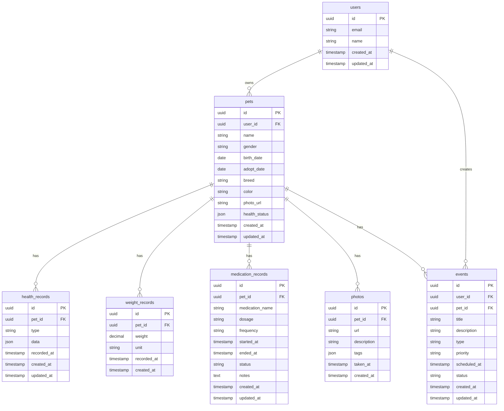

# データベース設計書

## 概要

Hariny（ハリネズミ健康管理アプリ）のデータベース設計書です。

## データベース選定

### 推奨データベース

- **Supabase** (PostgreSQL)
  - 理由：Next.js との相性が良く、リアルタイム機能、認証機能が組み込まれている
  - 無料プランで十分な機能を提供
  - TypeScript 対応が優れている

### 代替案

- **PlanetScale** (MySQL)
- **Vercel Postgres** (PostgreSQL)
- **Neon** (PostgreSQL)

## データモデル

### エンティティ関係図



## テーブル詳細設計

### 1. users テーブル

ユーザー情報を管理するテーブル

| カラム名   | データ型     | 制約             | 説明             |
| ---------- | ------------ | ---------------- | ---------------- |
| id         | uuid         | PRIMARY KEY      | ユーザー ID      |
| email      | varchar(255) | UNIQUE, NOT NULL | メールアドレス   |
| name       | varchar(100) | NOT NULL         | ユーザー名       |
| avatar_url | text         |                  | アバター画像 URL |
| created_at | timestamp    | DEFAULT NOW()    | 作成日時         |
| updated_at | timestamp    | DEFAULT NOW()    | 更新日時         |

### 2. pets テーブル

ハリネズミの基本情報を管理するテーブル

| カラム名      | データ型     | 制約          | 説明                     |
| ------------- | ------------ | ------------- | ------------------------ |
| id            | uuid         | PRIMARY KEY   | ペット ID                |
| user_id       | uuid         | FOREIGN KEY   | ユーザー ID              |
| name          | varchar(100) | NOT NULL      | ペット名                 |
| gender        | varchar(10)  | CHECK         | 性別（'male', 'female'） |
| birth_date    | date         |               | 誕生日                   |
| adopt_date    | date         |               | 飼育開始日               |
| breed         | varchar(100) |               | 品種                     |
| color         | varchar(100) |               | カラー                   |
| photo_url     | text         |               | 写真 URL                 |
| health_status | jsonb        |               | 健康状態（JSON）         |
| insurance     | varchar(200) |               | ペット保険情報           |
| is_active     | boolean      | DEFAULT true  | アクティブフラグ         |
| created_at    | timestamp    | DEFAULT NOW() | 作成日時                 |
| updated_at    | timestamp    | DEFAULT NOW() | 更新日時                 |

### 3. health_records テーブル

健康記録を管理するテーブル

| カラム名    | データ型    | 制約          | 説明               |
| ----------- | ----------- | ------------- | ------------------ |
| id          | uuid        | PRIMARY KEY   | 記録 ID            |
| pet_id      | uuid        | FOREIGN KEY   | ペット ID          |
| type        | varchar(50) | NOT NULL      | 記録タイプ         |
| data        | jsonb       | NOT NULL      | 記録データ（JSON） |
| recorded_at | timestamp   | NOT NULL      | 記録日時           |
| created_at  | timestamp   | DEFAULT NOW() | 作成日時           |
| updated_at  | timestamp   | DEFAULT NOW() | 更新日時           |

### 4. weight_records テーブル

体重記録を管理するテーブル

| カラム名    | データ型     | 制約          | 説明      |
| ----------- | ------------ | ------------- | --------- |
| id          | uuid         | PRIMARY KEY   | 記録 ID   |
| pet_id      | uuid         | FOREIGN KEY   | ペット ID |
| weight      | decimal(5,2) | NOT NULL      | 体重      |
| unit        | varchar(10)  | DEFAULT 'g'   | 単位      |
| recorded_at | timestamp    | NOT NULL      | 記録日時  |
| notes       | text         |               | メモ      |
| created_at  | timestamp    | DEFAULT NOW() | 作成日時  |

### 5. medication_records テーブル

投薬記録を管理するテーブル

| カラム名        | データ型     | 制約             | 説明       |
| --------------- | ------------ | ---------------- | ---------- |
| id              | uuid         | PRIMARY KEY      | 記録 ID    |
| pet_id          | uuid         | FOREIGN KEY      | ペット ID  |
| medication_name | varchar(200) | NOT NULL         | 薬品名     |
| dosage          | varchar(100) | NOT NULL         | 投与量     |
| frequency       | varchar(100) | NOT NULL         | 投与頻度   |
| started_at      | timestamp    | NOT NULL         | 開始日時   |
| ended_at        | timestamp    |                  | 終了日時   |
| status          | varchar(20)  | DEFAULT 'active' | ステータス |
| notes           | text         |                  | メモ       |
| created_at      | timestamp    | DEFAULT NOW()    | 作成日時   |
| updated_at      | timestamp    | DEFAULT NOW()    | 更新日時   |

### 6. photos テーブル

写真を管理するテーブル

| カラム名    | データ型  | 制約          | 説明              |
| ----------- | --------- | ------------- | ----------------- |
| id          | uuid      | PRIMARY KEY   | 写真 ID           |
| pet_id      | uuid      | FOREIGN KEY   | ペット ID         |
| url         | text      | NOT NULL      | 写真 URL          |
| description | text      |               | 説明              |
| tags        | jsonb     |               | タグ（JSON 配列） |
| taken_at    | timestamp |               | 撮影日時          |
| created_at  | timestamp | DEFAULT NOW() | 作成日時          |

### 7. events テーブル

イベント・スケジュールを管理するテーブル

| カラム名     | データ型     | 制約                | 説明           |
| ------------ | ------------ | ------------------- | -------------- |
| id           | uuid         | PRIMARY KEY         | イベント ID    |
| user_id      | uuid         | FOREIGN KEY         | ユーザー ID    |
| pet_id       | uuid         | FOREIGN KEY         | ペット ID      |
| title        | varchar(200) | NOT NULL            | タイトル       |
| description  | text         |                     | 説明           |
| type         | varchar(50)  | NOT NULL            | イベントタイプ |
| priority     | varchar(20)  | DEFAULT 'medium'    | 優先度         |
| scheduled_at | timestamp    | NOT NULL            | 予定日時       |
| status       | varchar(20)  | DEFAULT 'scheduled' | ステータス     |
| created_at   | timestamp    | DEFAULT NOW()       | 作成日時       |
| updated_at   | timestamp    | DEFAULT NOW()       | 更新日時       |

## インデックス設計

### 主要インデックス

```sql
-- パフォーマンス向上のためのインデックス
CREATE INDEX idx_pets_user_id ON pets(user_id);
CREATE INDEX idx_health_records_pet_id ON health_records(pet_id);
CREATE INDEX idx_health_records_recorded_at ON health_records(recorded_at);
CREATE INDEX idx_weight_records_pet_id ON weight_records(pet_id);
CREATE INDEX idx_weight_records_recorded_at ON weight_records(recorded_at);
CREATE INDEX idx_medication_records_pet_id ON medication_records(pet_id);
CREATE INDEX idx_medication_records_status ON medication_records(status);
CREATE INDEX idx_medication_records_started_at ON medication_records(started_at);
CREATE INDEX idx_photos_pet_id ON photos(pet_id);
CREATE INDEX idx_photos_taken_at ON photos(taken_at);
CREATE INDEX idx_events_user_id ON events(user_id);
CREATE INDEX idx_events_pet_id ON events(pet_id);
CREATE INDEX idx_events_scheduled_at ON events(scheduled_at);
CREATE INDEX idx_events_status ON events(status);
```

## 制約・ルール

### 外部キー制約

```sql
-- pets テーブル
ALTER TABLE pets ADD CONSTRAINT fk_pets_user_id
FOREIGN KEY (user_id) REFERENCES users(id) ON DELETE CASCADE;

-- health_records テーブル
ALTER TABLE health_records ADD CONSTRAINT fk_health_records_pet_id
FOREIGN KEY (pet_id) REFERENCES pets(id) ON DELETE CASCADE;

-- weight_records テーブル
ALTER TABLE weight_records ADD CONSTRAINT fk_weight_records_pet_id
FOREIGN KEY (pet_id) REFERENCES pets(id) ON DELETE CASCADE;

-- medication_records テーブル
ALTER TABLE medication_records ADD CONSTRAINT fk_medication_records_pet_id
FOREIGN KEY (pet_id) REFERENCES pets(id) ON DELETE CASCADE;

-- photos テーブル
ALTER TABLE photos ADD CONSTRAINT fk_photos_pet_id
FOREIGN KEY (pet_id) REFERENCES pets(id) ON DELETE CASCADE;

-- events テーブル
ALTER TABLE events ADD CONSTRAINT fk_events_user_id
FOREIGN KEY (user_id) REFERENCES users(id) ON DELETE CASCADE;
ALTER TABLE events ADD CONSTRAINT fk_events_pet_id
FOREIGN KEY (pet_id) REFERENCES pets(id) ON DELETE CASCADE;
```

### チェック制約

```sql
-- pets テーブル
ALTER TABLE pets ADD CONSTRAINT chk_pets_gender
CHECK (gender IN ('male', 'female'));

-- medication_records テーブル
ALTER TABLE medication_records ADD CONSTRAINT chk_medication_records_status
CHECK (status IN ('active', 'completed', 'discontinued'));

-- events テーブル
ALTER TABLE events ADD CONSTRAINT chk_events_priority
CHECK (priority IN ('low', 'medium', 'high'));
ALTER TABLE events ADD CONSTRAINT chk_events_status
CHECK (status IN ('scheduled', 'pending', 'completed', 'cancelled'));
ALTER TABLE events ADD CONSTRAINT chk_events_type
CHECK (type IN ('health', 'vet', 'grooming', 'cleaning', 'reminder'));
```

## データ型の詳細

### JSONB フィールドの構造

#### health_records.data

```json
{
  "type": "checkup",
  "eyes": {
    "condition": "clear",
    "discharge": false,
    "cloudiness": false,
    "redness": false,
    "notes": ""
  },
  "ears": {
    "condition": "clean",
    "discharge": false,
    "odor": false,
    "scratching": false,
    "notes": ""
  },
  "skin": {
    "condition": "healthy",
    "dryness": false,
    "redness": false,
    "scratching": false,
    "hairLoss": false,
    "notes": ""
  },
  "behavior": {
    "activity": "normal",
    "appetite": "good",
    "sleep": "normal",
    "wheelUsage": "sometimes",
    "notes": ""
  },
  "overall": {
    "healthStatus": "good",
    "concerns": "",
    "notes": ""
  }
}
```

#### pets.health_status

```json
{
  "lastCheckup": "2024-01-15T10:00:00Z",
  "currentStatus": "healthy",
  "vaccinations": [
    {
      "name": "混合ワクチン",
      "date": "2024-01-10",
      "nextDue": "2025-01-10"
    }
  ],
  "medications": [],
  "allergies": [],
  "notes": ""
}
```

#### photos.tags

```json
["体重測定", "健康チェック", "日常"]
```

## マイグレーション戦略

### バージョン管理

- 各マイグレーションは個別のファイルとして管理
- タイムスタンプベースの命名規則
- ロールバック対応

### マイグレーションファイル例

```sql
-- 001_create_users_table.sql
CREATE TABLE users (
    id UUID PRIMARY KEY DEFAULT gen_random_uuid(),
    email VARCHAR(255) UNIQUE NOT NULL,
    name VARCHAR(100) NOT NULL,
    avatar_url TEXT,
    created_at TIMESTAMP DEFAULT NOW(),
    updated_at TIMESTAMP DEFAULT NOW()
);

-- 002_create_pets_table.sql
CREATE TABLE pets (
    id UUID PRIMARY KEY DEFAULT gen_random_uuid(),
    user_id UUID NOT NULL REFERENCES users(id) ON DELETE CASCADE,
    name VARCHAR(100) NOT NULL,
    gender VARCHAR(10) CHECK (gender IN ('male', 'female')),
    birth_date DATE,
    adopt_date DATE,
    breed VARCHAR(100),
    color VARCHAR(100),
    photo_url TEXT,
    health_status JSONB,
    insurance VARCHAR(200),
    is_active BOOLEAN DEFAULT true,
    created_at TIMESTAMP DEFAULT NOW(),
    updated_at TIMESTAMP DEFAULT NOW()
);
```

## パフォーマンス考慮事項

### クエリ最適化

- 適切なインデックスの設定
- 不要な JOIN の回避
- ページネーションの実装

### データ量の見積もり

- 1 ユーザーあたり平均 2-3 匹のハリネズミ
- 1 匹あたり月 30 件の健康記録
- 1 匹あたり月 10 件の体重記録
- 1 匹あたり月 20 枚の写真

### スケーラビリティ

- パーティショニング戦略の検討
- アーカイブ戦略の検討
- 読み取り専用レプリカの活用

## セキュリティ考慮事項

### データ保護

- 個人情報の暗号化
- アクセス制御の実装
- 監査ログの記録

### 認証・認可

- Row Level Security (RLS) の実装
- ユーザー別データアクセス制御
- API 認証の実装

## バックアップ戦略

### バックアップ頻度

- 日次バックアップ
- 週次フルバックアップ
- 月次アーカイブ

### 復旧手順

- 障害復旧手順書の整備
- 定期復旧テストの実施
- データ整合性チェックの実装
